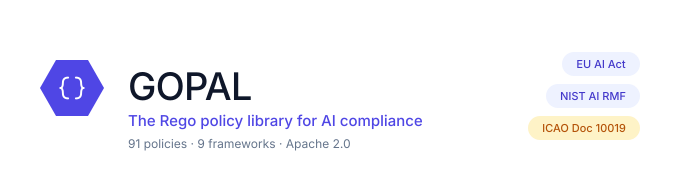
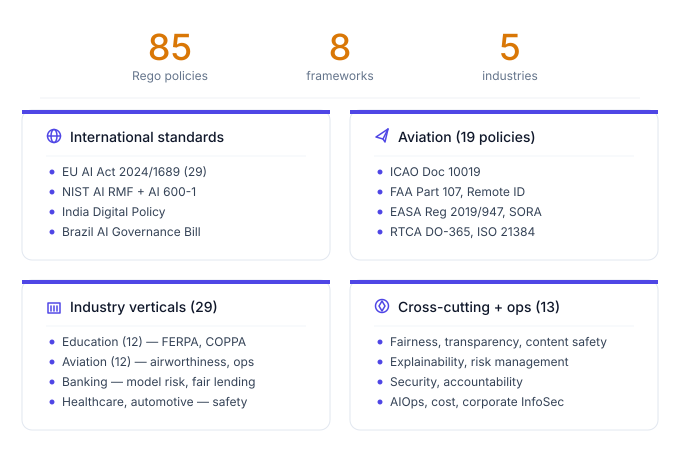
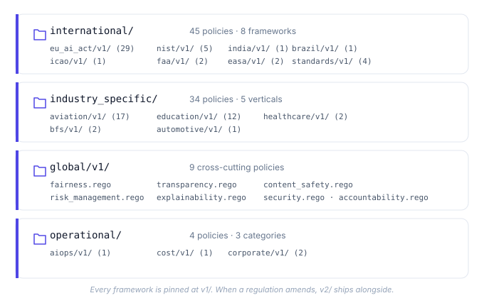

<div align="center">
  <picture>
    <source media="(prefers-color-scheme: dark)" srcset="diagrams/hero_banner_dark.svg">
    
  </picture>
</div>

<p align="center">
  <a href="README.md">English</a> |
  <a href="README.zh-CN.md">简体中文</a> |
  <a href="README.ja-JP.md">日本語</a> |
  <strong>한국어</strong> |
  <a href="README.hi-IN.md">हिन्दी</a>
</p>

<p align="center">
  <em>읽고, 실행하고, 비교하고, 증명할 수 있는 AI 컴플라이언스 규칙.</em>
</p>
<p align="center">
  <sub>85개 정책 · 국제 프레임워크 8개 · 산업 수직 영역 5개</sub>
</p>

<p align="center">
  <a href="https://github.com/Principled-Evolution/gopal/actions/workflows/opa-ci.yaml"></a>
  <a href="https://github.com/Principled-Evolution/gopal/stargazers"></a>
  <a href="https://github.com/Principled-Evolution/gopal/releases"></a>
  <a href="https://www.openpolicyagent.org/"></a>
  <a href="https://github.com/StyraInc/regal"></a>
  <a href="https://opensource.org/licenses/Apache-2.0"></a>
  
  
  <a href="https://makeapullrequest.com"></a>
</p>

<br>

**GOPAL: Governance Open Policy Agent Library.** AI 규제를 위한 오픈 정책 팩이라고 생각하면 됩니다.

Rego로 작성된 [OPA](https://www.openpolicyagent.org/) 정책을 엄선한 모음으로, EU AI Act, NIST AI RMF, 항공 안전 표준, 교육 분야의 FERPA/COPPA, 은행권의 공정 대출 규칙 등 실제 AI 거버넌스 요구사항을 코드로 인코딩합니다.

여러분의 AI 시스템 메타데이터, 모델 카드, 평가 결과에 대해 이 정책들을 실행하면 구조화된 기계 판독 가능 컴플라이언스 판정 결과를 얻을 수 있으며, CI, 감사 로그, 규제 당국 제출 자료에 그대로 적용할 수 있습니다.

<p align="center">
  <picture>
    <source media="(prefers-color-scheme: dark)" srcset="diagrams/diagram1_hero_numbers_dark.svg">
    
  </picture>
</p>

---

## 읽고, 실행하고, 비교하고, 증명할 수 있는 AI 컴플라이언스 규칙

GOPAL은 EU AI Act, NIST AI RMF, 항공 안전 표준, FERPA/COPPA, 공정 대출 규칙, 의료 안전 등 규제 및 거버넌스 요구사항을 실행 가능한 OPA 정책으로 바꿔 줍니다.

다음과 같은 AI 거버넌스 검사를 원한다면 GOPAL이 적합합니다.

- **읽기 쉬움**: 모든 규칙은 Rego 코드이며 블랙박스 점수가 아닙니다
- **검토 가능**: 정책 변경은 풀 리퀘스트를 거칩니다
- **테스트 가능**: 모든 정책에 allow/deny 테스트 케이스를 둘 수 있습니다
- **버전 관리 가능**: 프레임워크가 발전해도 특정 버전에 고정한 사용자는 영향을 받지 않습니다
- **자동화 가능**: CI/CD, 감사 워크플로, AICertify에서 검사를 실행할 수 있습니다

---

## 왜 지금인가

EU AI Act는 이미 시행 중입니다. NIST AI RMF는 사실상 미국의 기준이 되었습니다. 영국, 인도, 브라질, 싱가포르, 캘리포니아주 모두 관련 입법을 추진하고 있습니다. 항공 당국은 AI/UAS 가이던스를 발표하고 있고, 금융 감독 당국은 모델 리스크 관련 요구사항을 내놓고 있습니다.

엔지니어링 팀에 필요한 것은 CI에서 실행되는 AI 거버넌스 검사이지, 공유 드라이브에 잠들어 있는 PDF나 검토 회의 자료에 붙여넣은 스크린샷이 아닙니다.

GOPAL은 이러한 각 규제 체계에 대응하는 실행 가능한 Rego 정책을 제공합니다. 버전 관리되고, 테스트 가능하며, 풀 리퀘스트로 검토할 수 있습니다. 여러분의 플랫폼 팀이 쿠버네티스 어드미션 컨트롤에 이미 사용하고 있는 것과 같은 도구 체인으로, 이제 AI 시스템 요구사항도 강제할 수 있습니다.

---

## 빠른 시작

<p align="center">
  <picture>
    <source media="(prefers-color-scheme: dark)" srcset="diagrams/diagram5_evaluation_flow_dark.svg">
    
  </picture>
</p>

### 30초 만에 GOPAL 체험하기

```bash
git clone https://github.com/Principled-Evolution/gopal.git
cd gopal/examples/eu-ai-act-transparency
./run.sh
```

샘플 AI 시스템에 대한 구조화된 EU AI Act 투명성 판정 결과를 확인할 수 있습니다. NIST AI RMF, 고객 지원 LLM 등 더 많은 예제는 [`examples/`](examples/)를 참고하세요.

### OPA CLI를 사용한 단독 실행

```bash
# OPA 설치
curl -L -o opa https://openpolicyagent.org/downloads/latest/opa_linux_amd64 && chmod +x opa

# gopal 클론
git clone https://github.com/Principled-Evolution/gopal.git && cd gopal

# EU AI Act에 대해 입력을 평가합니다
./opa eval -d international/eu_ai_act/v1 \
  --input my_ai_system.json \
  "data.international.eu_ai_act.v1.transparency.allow"
```

### AICertify의 정책 엔진으로 사용

```python
from aicertify import regulations, application

regs = regulations.create("eu_compliance")
regs.add("eu_ai_act")  # 내부적으로 gopal 정책을 사용합니다

app = application.create(name="my-llm-app", ...)
await app.evaluate(regulations=regs, report_format="pdf")
```

전체 Python 프레임워크는 [AICertify](https://github.com/Principled-Evolution/aicertify)를 참고하세요.

---

## GOPAL을 선택해야 하는 이유

대부분의 "AI 거버넌스"는 슬라이드 자료 안에만 머물러 있습니다. 공개된 몇 안 되는 구현체도 다음 중 하나에 치우쳐 있습니다.

- **범용 OPA 번들**(쿠버네티스 어드미션에는 훌륭하지만 EU AI Act에는 적합하지 않음), 아니면
- **비공개 SaaS**로, 여러분이 어떤 기준으로 판단받는지 그 규칙을 숨겨 둡니다.

GOPAL은 세 가지 측면에서 다릅니다.

1. **처음부터 AI에 특화된 설계.** 모든 정책은 편향, 투명성, 인간의 감독, 모델 리스크, 콘텐츠 안전, 안전 필수 인증 등 AI 시스템 고유의 관심사를 대상으로 하며, 범용 인프라를 대상으로 하지 않습니다.
2. **읽기 쉬움.** 규칙은 그저 Rego입니다. `cat`으로 열어 보고, PR에서 차이를 비교하고, 그 내용을 추론할 수 있습니다. 블랙박스 점수표는 없습니다.
3. **버전 관리.** 모든 프레임워크는 `v1/`(이후 `v2/` 등) 아래에 있으며 명시적인 시맨틱 버저닝을 보장합니다. 자세한 내용은 [COMPATIBILITY.md](COMPATIBILITY.md)를 참고하세요. EU AI Act가 개정되어도 이전 버전은 그대로 유지됩니다.

---

## OPA / Rego 사용자를 위한 안내

이미 쿠버네티스 어드미션, 클라우드 인가, CI/CD, 서비스 메시에 OPA를 사용하고 있다면, GOPAL은 인프라가 아니라 AI 시스템을 대상으로 하는 정책 라이브러리를 제공합니다.

패키지 구성, 명명 규칙, 테스트 패턴 모두 정통 Rego 방식을 따르며, 별도의 DSL도 없고 평가에 Python도 필요 없습니다. 다음과 같은 것들이 가능합니다.

- 개별 프레임워크(`international/eu_ai_act/v1/`, `industry_specific/aviation/v1/` 등)를 여러분의 번들로 가져오기
- `opa eval`, [Conftest](https://www.conftest.dev/), 또는 기존 OPA 서버로 평가하기
- 메이저 버전(`v1/`)에 고정하고 업그레이드를 PR로 검토하기
- 같은 평가 안에서 GOPAL 규칙과 여러분 조직의 `custom/` 규칙을 함께 사용하기
- [Regal](https://github.com/StyraInc/regal)로 린트하기, GOPAL 자체도 CI에서 같은 린터를 사용합니다

입력 수집과 PDF/Markdown 리포트 생성까지 처리해 주는 Python 프레임워크가 필요하다면 [AICertify](https://github.com/Principled-Evolution/aicertify)를 참고하세요.

---

## 구성 내용

<p align="center">
  <picture>
    <source media="(prefers-color-scheme: dark)" srcset="diagrams/diagram2_directory_tree_dark.svg">
    
  </picture>
</p>

```
gopal/
├── international/        국경을 초월하는 프레임워크
│   ├── eu_ai_act/v1/         29 policies — EU AI Act 2024/1689
│   ├── nist/v1/              5  policies — NIST AI RMF + AI 600-1
│   ├── india/v1/             1  policy   — Digital India Policy
│   ├── brazil/v1/            1  policy   — AI Governance Bill
│   ├── icao/v1/              1  policy   — ICAO Doc 10019
│   ├── faa/v1/               2  policies — Part 107, Remote ID
│   ├── easa/v1/              2  policies — Regulation 2019/947, SORA
│   └── standards/v1/         2  policies — RTCA DO-365, ISO 21384
│
├── industry_specific/    산업별 요구사항
│   ├── education/v1/         12 policies — FERPA, COPPA, 시험 감독, 채점
│   ├── aviation/v1/          12 policies — 감항성, 자율성, 데이터, 운항
│   ├── healthcare/v1/         2 policies — 환자 및 진단 안전
│   ├── bfs/v1/                2 policies — 모델 리스크, 공정 대출
│   └── automotive/v1/         1 policy   — 차량 안전 통합
│
├── global/v1/             9  policies — 책임성, 공정성, 투명성,
│                                       설명 가능성, 콘텐츠 안전,
│                                       리스크 관리, 보안, 공통 규칙
│
├── operational/          DevOps 및 기업 운영
│   ├── aiops/v1/              1 policy   — 확장성
│   ├── cost/v1/               1 policy   — 리소스 효율성
│   └── corporate/v1/          2 policies — 정보 보안, 거버넌스
│
├── helper_functions/     정책 작성자를 위한 공유 유틸리티
│   ├── reporting.rego        표준화된 리포트 출력 헬퍼
│   └── validation.rego       필드 존재 및 필수 필드 검사
│
└── custom/               비공개 정책 (git-ignored, CI 제외)
```

**프로덕션 정책 85개, 테스트를 포함해 총 124개의 Rego 파일.**

---

## 비교

| | GOPAL | 범용 OPA 번들 | 벤더 거버넌스 SaaS |
|---|---|---|---|
| AI 시스템을 특정해 대상화 | ✅ | ❌ | ✅ |
| 오픈소스(Apache 2.0) | ✅ | ✅ | ❌ |
| 모든 규칙을 직접 읽을 수 있음 | ✅ Rego | ✅ Rego | ❌ 비공개 |
| 명명된 규제 추적(EU AI Act, NIST RMF, FAA) | ✅ 10개 이상 | ❌ | 일부 |
| 기본 제공 산업 수직 영역 | ✅ 5개 | ❌ | 제한적 |
| 항공 / 안전 필수 분야 커버리지 | ✅ ICAO, RTCA, FAA, EASA, ISO | ❌ | ❌ |
| 교육 분야(FERPA / COPPA) | ✅ | ❌ | 드묾 |
| 정책 버전 관리(`v1/`, `v2/` …) | ✅ 시맨틱 버저닝 | 다양 | 해당 없음 |
| CI/CD 통합 | ✅ `opa check` + Regal | ✅ | 다양 |
| 맞춤형 로컬 정책(업스트림 미공유) | ✅ `custom/`은 git-ignored | ❌ | 유료 등급 |

알아 두면 좋은 다른 오픈소스 프로젝트로는, [VerifyWise](https://github.com/verifywise-ai/verifywise)와 [Compl-AI](https://github.com/compl-ai/compl-ai)가 있으며 둘 다 EU AI Act 등 여러 프레임워크에 따라 AI 시스템을 평가합니다. [airblackbox](https://github.com/airblackbox)는 LangChain, CrewAI, AutoGen 같은 에이전트 프레임워크를 런타임에 스캔해 컴플라이언스 격차를 찾아냅니다. GOPAL의 차이점은 순수한 Rego/OPA라서 이미 쿠버네티스나 클라우드 인가에 사용 중인 정책 도구 체인에 그대로 들어맞는다는 점, 그리고 대상이 EU AI Act에만 국한되지 않는다는 점입니다. 항공, 교육, 은행권 프레임워크도 같은 코드 트리 안에 있으며 동일한 방식으로 버전 관리되고 테스트됩니다.

---

## GOPAL과 AICertify

| 필요한 것 | 사용할 것 |
|---|---|
| 순수한 Rego 정책 | GOPAL |
| AI 애플리케이션 평가와 리포트 생성 | AICertify |
| 기존 OPA 도구 체인에 정책 연결 | GOPAL |
| PDF/Markdown/JSON 감사 리포트 | AICertify |

AICertify는 내부적으로 GOPAL을 사용합니다. 이미 OPA 워크플로가 있고 이를 AI 전용 규칙으로 확장하고 싶다면 GOPAL을 선택하세요. AI 애플리케이션의 상호작용을 수집하고 감사 대응 근거 자료를 처음부터 끝까지 생성하는 Python 프레임워크가 필요하다면 AICertify를 선택하세요.

---

## 정책 작성

<p align="center">
  <picture>
    <source media="(prefers-color-scheme: dark)" srcset="diagrams/diagram3_policy_anatomy_dark.svg">
    
  </picture>
</p>

모든 정책은 동일한 형태를 따릅니다.

```rego
package international.eu_ai_act.v1.transparency

import data.helper_functions.reporting

# Metadata describes the rule for tooling and auditors.
# METADATA
# title: Transparency for general-purpose AI systems
# description: GPAI providers must publish technical documentation per Article 53.

default allow := false

allow if {
    input.system.technical_documentation_published == true
    input.system.training_data_summary_published == true
}

report := reporting.compose_report(
    "eu_ai_act.transparency",
    allow,
    [{"name": "documentation_present", "value": allow, "control_passed": allow}],
)
```

그런 다음 형제 `*_test.rego` 파일이 해당 규칙을 검증합니다. CI는 다음을 강제합니다.

1. **`opa check`**: 모든 패키지에 걸친 구문과 참조 정확성
2. **`regal lint`**: Rego 스타일과 모범 사례

[helper_functions/](helper_functions/) 라이브러리는 `compose_report()`, `validate_required_fields()`, `field_exists()`를 제공해, 누가 규칙을 작성하든 리포트가 일관된 형식으로 출력되도록 해 줍니다.

단계별 안내는 [`docs/tutorials/add-your-first-policy.md`](docs/tutorials/add-your-first-policy.md), 프레임워크별 커버리지 표는 [`docs/coverage/`](docs/coverage/)를 참고하세요.

---

## 정책의 정확성

GOPAL은 법률 자문이 아닙니다. 여기 있는 정책들은 공개된 규제 및 거버넌스 요구사항을 엔지니어가 실행 가능한 형태로 해석한 것입니다. 올바르게 작성하려고 노력하지만, 결국은 해석입니다.

어떤 규칙이 규제를 잘못 해석했거나 의무 사항을 놓쳤다고 생각되면, 다음 내용을 담아 이슈를 열어 주세요.

- 해당 규제, 조항, 조문
- 여러분의 해석
- 기대하는 입출력 동작
- 공식 가이던스, 규제 당국 문서, 선례 등

정책 정확성에 대한 의견 차이는 보안 취약점이 아닙니다. 보안 취약점은 [SECURITY.md](SECURITY.md)를 참고하세요. 오히려 이런 의견 차이야말로 공개적으로 다루고 싶은 문제이며, 그래야 커뮤니티가 함께 규칙을 검토하고 개선할 수 있습니다.

---

## 맞춤형 정책

`custom/` 디렉터리는 **조직의 독점 정책**을 위한 공간입니다. 이 디렉터리는 다음과 같은 특징을 가집니다.

- `.gitignore` 처리되어 이 리포지토리에 푸시되지 않습니다
- CI에서 제외됩니다
- 공개 트리와 동일한 구조(`custom/your_org/v1/...`)를 가집니다

포크 없이 내부 AI 활용 사례 규칙을 추가할 수 있으며, 공개 세트와 함께 평가됩니다.

---

## 개발

```bash
# 일회성 설정
pip install pre-commit
curl -L -o opa https://openpolicyagent.org/downloads/latest/opa_linux_amd64 && chmod +x opa && sudo mv opa /usr/local/bin/
curl -L -o regal https://github.com/StyraInc/regal/releases/latest/download/regal_Linux_x86_64 && chmod +x regal && sudo mv regal /usr/local/bin/
pre-commit install

# CI가 실행하는 것과 동일한 검사를 실행합니다
opa check --ignore custom/ .
regal lint --ignore-files custom/ .
```

PR 워크플로는 [CONTRIBUTING.md](CONTRIBUTING.md)를 참고하세요.

---

## 로드맵

- **NIST 커버리지 확대**: Measure / Manage 컨트롤 보강
- **영국 AI 규제 원칙**: 혁신 친화적 프레임워크 규칙
- **캘리포니아 SB-1047 후속 법안**: 최종 확정 시 반영
- **MAS / HKMA 은행권 AI 가이던스**: APAC 금융 감독

필요한 프레임워크가 있다면 이슈를 열어 주세요.

---

## 관련 프로젝트

- **[AICertify](https://github.com/Principled-Evolution/aicertify)**: GOPAL을 사용해 AI 애플리케이션을 평가하고 감사 준비 PDF/MD/JSON 리포트를 생성하는 Python 프레임워크.
- **[Open Policy Agent](https://www.openpolicyagent.org/)**: 정책 엔진.
- **[Regal](https://github.com/StyraInc/regal)**: CI에서 사용하는 Rego 린터.

---

## 커뮤니티 및 지원

Rego, OPA, GitHub 관례를 몰라도 답변을 받을 수 있습니다.

| 하려는 일 | 이동할 곳 |
| --- | --- |
| GOPAL을 사내 CI, OPA 서버, 플랫폼에 연동하는 방법 문의 | [연동 지원 양식](https://github.com/Principled-Evolution/gopal/issues/new?template=integration_help.yml) 또는 [Q&A 토론](https://github.com/Principled-Evolution/gopal/discussions/new?category=q-a) |
| GOPAL이 아직 다루지 않는 규제나 표준 요청 | [신규 프레임워크 요청](https://github.com/Principled-Evolution/gopal/issues/new?template=new_framework.yml) |
| 이미 지원하는 프레임워크 내 특정 정책 요청 | [신규 정책 요청](https://github.com/Principled-Evolution/gopal/issues/new?template=new_policy.yml) |
| 정책이 잘못된 판정을 반환하는 문제 신고 | [버그 신고](https://github.com/Principled-Evolution/gopal/issues/new?template=bug_report.yml) |
| GitHub 대신 이메일로 연락 | **gopal@principledevolution.ai** |
| 보안 취약점 신고 | [SECURITY.md](SECURITY.md) 참조. 공개 이슈로 등록하지 마세요 |

등록하기 전에 다음 두 곳을 보면 대부분의 질문이 해결됩니다. [커버리지 매트릭스](docs/coverage)는 조항별 구현 현황을 보여 주고, [FAQ](docs/FAQ.md)는 적용 범위와 입력 형식, AICertify와의 관계를 다룹니다.

규모와 무관하게 모든 기여를 환영합니다. [CONTRIBUTING.md](CONTRIBUTING.md)를 참조하세요. 참여에는 [행동 규범](CODE_OF_CONDUCT.md)이 적용됩니다.

---

## 라이선스

Apache License 2.0. 자세한 내용은 [LICENSE](LICENSE)를 참고하세요.

<p align="center"><sub><a href="https://github.com/Principled-Evolution">Principled Evolution</a>이 유지 관리 · 읽고, 실행하고, 증명할 수 있는 컴플라이언스.</sub></p>
