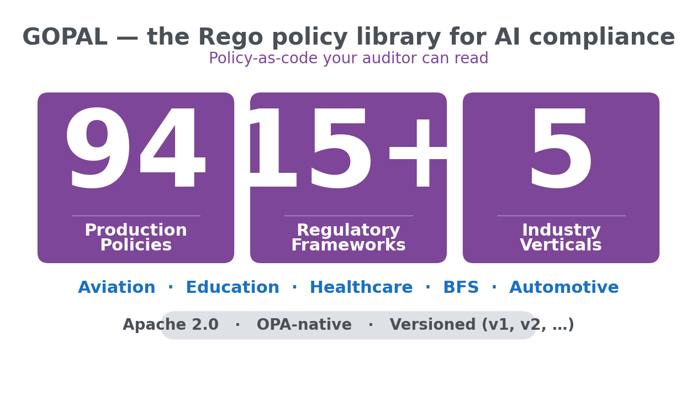
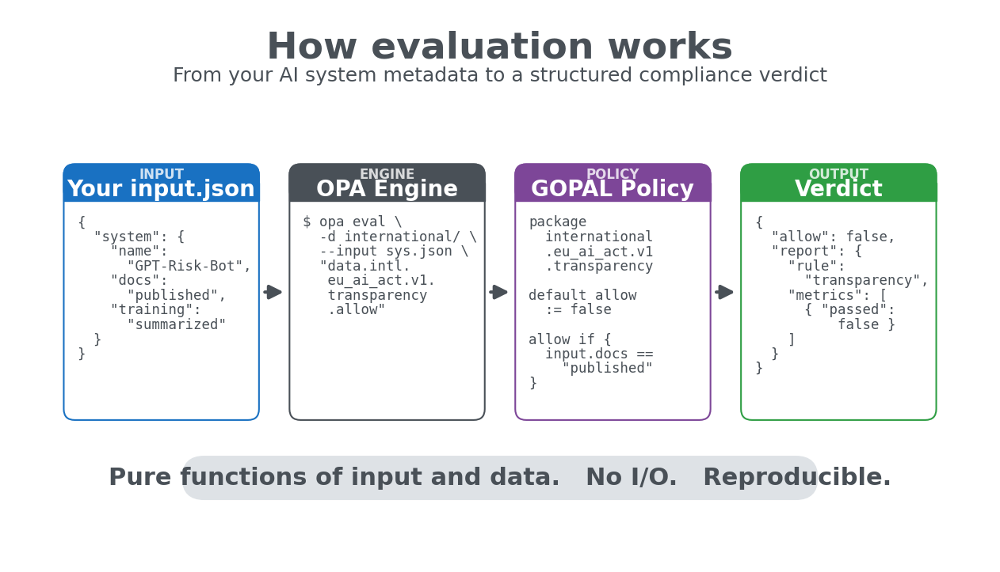
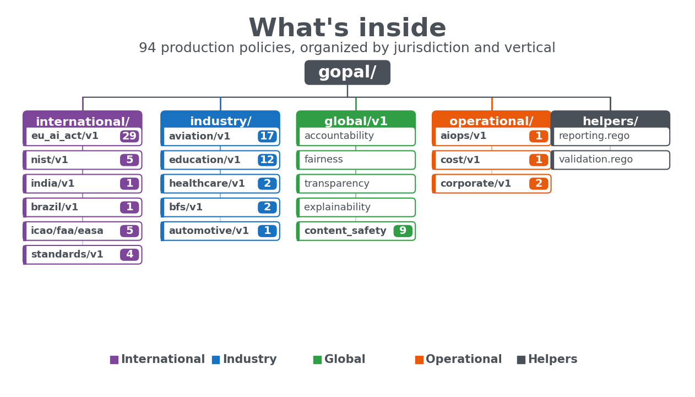
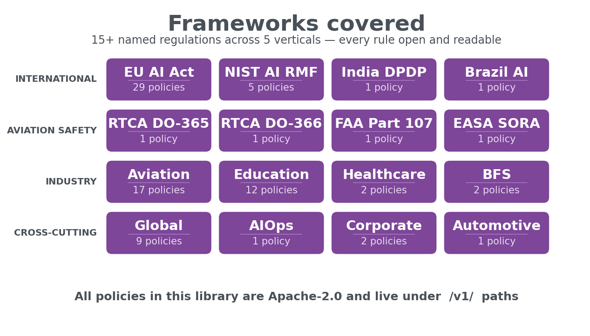
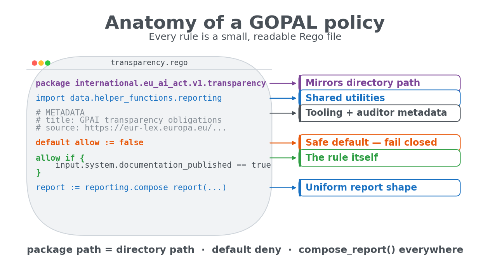

<h1 align="center">GOPAL</h1>

<p align="center">
  <a href="README.md">English</a> |
  <a href="README.zh-CN.md">简体中文</a> |
  <a href="README.ja-JP.md">日本語</a> |
  <strong>한국어</strong> |
  <a href="README.hi-IN.md">हिन्दी</a>
</p>

<p align="center">
  <strong>AI 컴플라이언스를 위한 Rego 정책 라이브러리.</strong>
</p>

<p align="center">
  <em>94개 정책. 15개 이상의 규제 프레임워크. 5개 산업 수직 영역. 감사관이 읽을 수 있는 정책 코드화(policy-as-code).</em>
</p>

<p align="center">
  <a href="https://github.com/Principled-Evolution/gopal/actions/workflows/opa-ci.yaml"></a>
  <a href="https://github.com/Principled-Evolution/gopal/stargazers"></a>
  <a href="https://github.com/Principled-Evolution/gopal/releases"></a>
  <a href="https://www.openpolicyagent.org/"></a>
  <a href="https://github.com/StyraInc/regal"></a>
  <a href="https://opensource.org/licenses/Apache-2.0"></a>
  
  
  <a href="https://makeapullrequest.com"></a>
</p>

<br>

**Governance Open Policy Agent Library** — Rego로 작성된 [OPA](https://www.openpolicyagent.org/) 정책의 큐레이션된 모음으로, 실제 AI 거버넌스 요구사항을 인코딩합니다. EU AI Act, NIST AI RMF, 항공 안전 표준, 교육 분야의 FERPA/COPPA, 은행권의 공정 대출 규칙 등이 포함됩니다.

여러분의 AI 시스템 메타데이터, 모델 카드 또는 평가 결과에 대해 이러한 정책을 실행하면, CI, 감사 로그 또는 규제 당국 제출 자료에 그대로 적용할 수 있는 구조화된 기계 판독 가능 컴플라이언스 결과를 얻을 수 있습니다.

<p align="center"></p>

---

## 빠른 시작

<p align="center"></p>

### OPA CLI를 사용한 단독 실행

```bash
# OPA 설치
curl -L -o opa https://openpolicyagent.org/downloads/latest/opa_linux_amd64 && chmod +x opa

# gopal 클론
git clone https://github.com/Principled-Evolution/gopal.git && cd gopal

# EU AI Act에 대해 입력을 평가합니다
./opa eval -d international/eu_ai_act/v1 \
  --input my_ai_system.json \
  "data.international.eu_ai_act.v1.transparency.allow"
```

### AICertify의 정책 엔진으로 사용

```python
from aicertify import regulations, application

regs = regulations.create("eu_compliance")
regs.add("eu_ai_act")  # 내부적으로 gopal 정책을 사용합니다

app = application.create(name="my-llm-app", ...)
await app.evaluate(regulations=regs, report_format="pdf")
```

전체 Python 프레임워크는 [AICertify](https://github.com/Principled-Evolution/aicertify)를 참고하세요.

---

## GOPAL을 선택해야 하는 이유

대부분의 "AI 거버넌스"는 슬라이드 자료 안에 머물러 있습니다. 공개된 몇 안 되는 구현체는 다음 중 하나입니다.

- **범용 OPA 번들** — 쿠버네티스 어드미션에는 훌륭하지만 EU AI Act에는 적합하지 않습니다.
- **비공개 SaaS** — 여러분이 판단받는 기준이 되는 규칙을 숨겨 둡니다.

GOPAL은 세 가지 측면에서 다릅니다.

1. **AI에 특화된 설계.** 모든 정책은 편향, 투명성, 인간의 감독, 모델 리스크, 콘텐츠 안전, 안전 필수 인증과 같은 AI 시스템의 관심사를 대상으로 하며, 범용 인프라가 아닙니다.
2. **읽기 쉬움.** 규칙은 Rego입니다. `cat`으로 확인하고, PR에서 차이를 비교하며, 그 의미를 추론할 수 있습니다. 블랙박스 점수표는 없습니다.
3. **버전 관리.** 모든 프레임워크는 `v1/`(이후 `v2/` 등) 아래에 존재하며 명시적인 시맨틱 버저닝 보장을 제공합니다 — [COMPATIBILITY.md](COMPATIBILITY.md) 참고. EU AI Act가 개정되어도 이전 버전은 그대로 유지됩니다.

---

## 구성 내용

<p align="center"></p>

```
gopal/
├── international/        국경을 초월하는 프레임워크
│   ├── eu_ai_act/v1/         29 policies — EU AI Act 2024/1689
│   ├── nist/v1/              5  policies — NIST AI RMF + AI 600-1
│   ├── india/v1/             1  policy   — Digital India Policy
│   ├── brazil/v1/            1  policy   — AI Governance Bill
│   ├── icao/v1/              1  policy   — ICAO Doc 10019
│   ├── faa/v1/               2  policies — FAA Part 107, Remote ID
│   ├── easa/v1/              2  policies — Regulation 2019/947, SORA
│   └── standards/v1/         4  policies — RTCA DO-365/366, ASTM F3442, ISO 21384
│
├── industry_specific/    산업별 요구사항
│   ├── aviation/v1/          17 policies — 감지 및 회피, 인증, 설계
│   ├── education/v1/         12 policies — FERPA, COPPA, 시험 감독, 채점
│   ├── healthcare/v1/         2 policies — 환자 및 진단 안전
│   ├── bfs/v1/                2 policies — 모델 리스크, 공정 대출
│   └── automotive/v1/         1 policy   — 차량 안전 통합
│
├── global/v1/             9  policies — 책임성, 공정성, 투명성,
│                                       설명 가능성, 콘텐츠 안전,
│                                       리스크 관리, 보안, 공통 규칙
│
├── operational/          DevOps 및 기업 운영
│   ├── aiops/v1/              1 policy   — 확장성
│   ├── cost/v1/               1 policy   — 리소스 효율성
│   └── corporate/v1/          2 policies — 정보 보안, 거버넌스
│
├── helper_functions/     정책 작성자를 위한 공유 유틸리티
│   ├── reporting.rego        표준화된 리포트 출력 헬퍼
│   └── validation.rego       필드 존재 및 필수 필드 검사
│
└── custom/               비공개 정책 (git-ignored, CI 제외)
```

**94개의 프로덕션 정책. 테스트를 포함해 총 125개의 Rego 파일.**

---

## 비교

<p align="center"></p>

| | GOPAL | 범용 OPA 번들 | 벤더 거버넌스 SaaS |
|---|---|---|---|
| AI 시스템을 특정해 대상화 | ✅ | ❌ | ✅ |
| 오픈소스 (Apache 2.0) | ✅ | ✅ | ❌ |
| 모든 규칙을 직접 읽을 수 있음 | ✅ Rego | ✅ Rego | ❌ 비공개 |
| 명명된 규제 추적 (EU AI Act, NIST RMF, FAA) | ✅ 15개 이상 | ❌ | 일부 |
| 기본 제공 산업 수직 영역 | ✅ 5개 | ❌ | 제한적 |
| 항공 / 안전 필수 분야 커버리지 | ✅ ICAO, RTCA, FAA, EASA, ASTM | ❌ | ❌ |
| 교육 분야 (FERPA / COPPA) | ✅ | ❌ | 드묾 |
| 정책 버전 관리 (`v1/`, `v2/` …) | ✅ 시맨틱 버저닝 | 다양 | 해당 없음 |
| CI/CD 통합 | ✅ `opa check` + Regal | ✅ | 다양 |
| 맞춤형 로컬 정책 (업스트림 미공유) | ✅ `custom/`은 git-ignored | ❌ | 유료 등급 |

---

## 정책 작성

<p align="center"></p>

모든 정책은 동일한 형태를 따릅니다.

```rego
package international.eu_ai_act.v1.transparency

import data.helper_functions.reporting

# Metadata describes the rule for tooling and auditors.
# METADATA
# title: Transparency for general-purpose AI systems
# description: GPAI providers must publish technical documentation per Article 53.

default allow := false

allow if {
    input.system.technical_documentation_published == true
    input.system.training_data_summary_published == true
}

report := reporting.compose_report(
    "eu_ai_act.transparency",
    allow,
    [{"name": "documentation_present", "value": allow, "control_passed": allow}],
)
```

그런 다음 형제 `*_test.rego` 파일이 해당 규칙을 검증합니다. CI는 다음을 강제합니다.

1. **`opa check`** — 모든 패키지에 걸친 구문 + 참조 정확성
2. **`regal lint`** — Rego 스타일 + 모범 사례

[helper_functions/](helper_functions/) 라이브러리는 `compose_report()`, `validate_required_fields()`, `field_exists()`를 제공하여, 누가 규칙을 작성하든 리포트가 일관된 형식으로 출력되도록 합니다.

---

## 맞춤형 정책

`custom/` 디렉터리는 **조직의 독점 정책**을 위한 공간입니다. 이 디렉터리는 다음과 같은 특징을 가집니다.

- `.gitignore` 처리되어 이 리포지토리에 푸시되지 않습니다
- CI에서 제외됩니다
- 공개 트리와 동일한 구조 (`custom/your_org/v1/...`)를 가집니다

포크 없이 내부 AI 활용 사례 규칙을 추가할 수 있으며, 공개 세트와 함께 평가됩니다.

---

## 개발

```bash
# 일회성 설정
pip install pre-commit
curl -L -o opa https://openpolicyagent.org/downloads/latest/opa_linux_amd64 && chmod +x opa && sudo mv opa /usr/local/bin/
curl -L -o regal https://github.com/StyraInc/regal/releases/latest/download/regal_Linux_x86_64 && chmod +x regal && sudo mv regal /usr/local/bin/
pre-commit install

# CI가 실행하는 것과 동일한 검사를 실행합니다
opa check --ignore custom/ .
regal lint --ignore-files custom/ .
```

PR 워크플로는 [CONTRIBUTING.md](CONTRIBUTING.md)를 참고하세요.

---

## 로드맵

- **NIST 커버리지 확대** — Measure / Manage 컨트롤 보강
- **영국 AI 규제 원칙** — 혁신 친화적 프레임워크 규칙
- **캘리포니아 SB-1047 후속 법안** — 최종 확정 시
- **MAS / HKMA 은행권 AI 가이던스** — APAC 금융 감독
- **항공 분야 추가 수직 영역** — UAS 전용 감항성

필요한 프레임워크가 있다면 이슈를 열어 주세요.

---

## 관련 프로젝트

- **[AICertify](https://github.com/Principled-Evolution/aicertify)** — GOPAL을 사용해 AI 애플리케이션을 평가하고 감사 준비 PDF/MD/JSON 리포트를 생성하는 Python 프레임워크.
- **[Open Policy Agent](https://www.openpolicyagent.org/)** — 정책 엔진.
- **[Regal](https://github.com/StyraInc/regal)** — CI에서 사용하는 Rego 린터.

---

## 라이선스

Apache License 2.0 — [LICENSE](LICENSE) 참고.

<p align="center"><sub><a href="https://github.com/Principled-Evolution">Principled Evolution</a>이 유지 관리 · 읽고, 실행하고, 증명할 수 있는 컴플라이언스.</sub></p>
